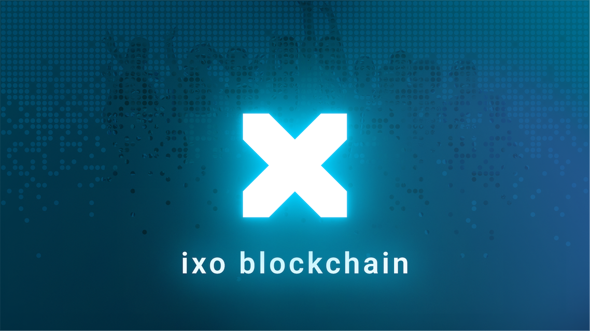

# ixo Blockchain

  

  

 

  

 

The ixo Blockchain is a Layer 1 blockchain that runs on both Testnet and Mainnet. It is built using the [Cosmos SDK](https://docs.cosmos.network/main), [Tendermint](https://docs.tendermint.com/), and [IBC](https://ibc.cosmos.network/), and was one of the earliest networks to incorporate these technologies.

Have a look at [go.mod](https://github.com/ixofoundation/ixo-blockchain/blob/main/go.mod) for specific dependencies and their most recent versions.

The ixo Blockchain powers client applications for coordinating, financing and verifying impacts. The [Impacts Wallet](https://github.com/ixofoundation/ixo-Mobile-dev), [JAMBO](https://github.com/ixofoundation/jambo), and [Launchpad](https://github.com/ixofoundation/ixo-webclient) are examples of client applications that use the ixo Blockchain. The [Impacts SDK](https://www.npmjs.com/package/@ixo/impactxclient-sdk) makes it simple to interact with the ixo Blockchain.

Ixo has 8 custom cosmos modules which help to reach the Ixo goals and missions:

- [Bonds](/x/bonds/spec/README.md)
- [Iid](/x/iid/spec/README.md)
- [Entity](/x/entity/spec/README.md)
- [Claims](/x/claims/spec/README.md)
- [Token](/x/token/spec/README.md)
- [Epochs](/x/epochs/README.md)
- [Mint](/x/mint/README.md)
- [Smart Account](/x/smart-account/README.md)

## 🤝 How to contribute

If you are interested in contributing to the ixo Blockchain, there are many opportunities to get involved, such as contributing code or participating in community discussions. See the [How to Contribute section](https://github.com/ixofoundation#how-to-contribute) of our documentation for more details.

Our community is passionate about using blockchain technology to create positive impacts in the world. We believe in the power of collaboration and innovation to drive change, and we welcome anyone who shares our vision to join us on Discord or Telegram.
