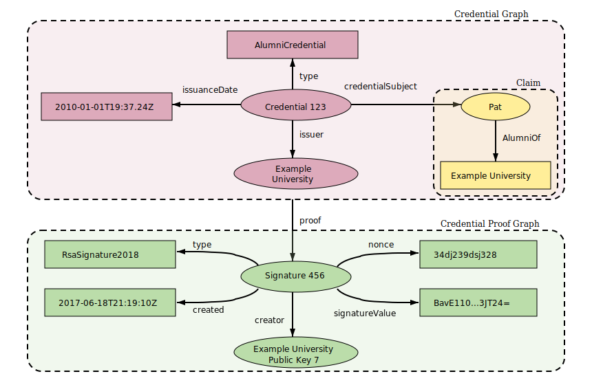
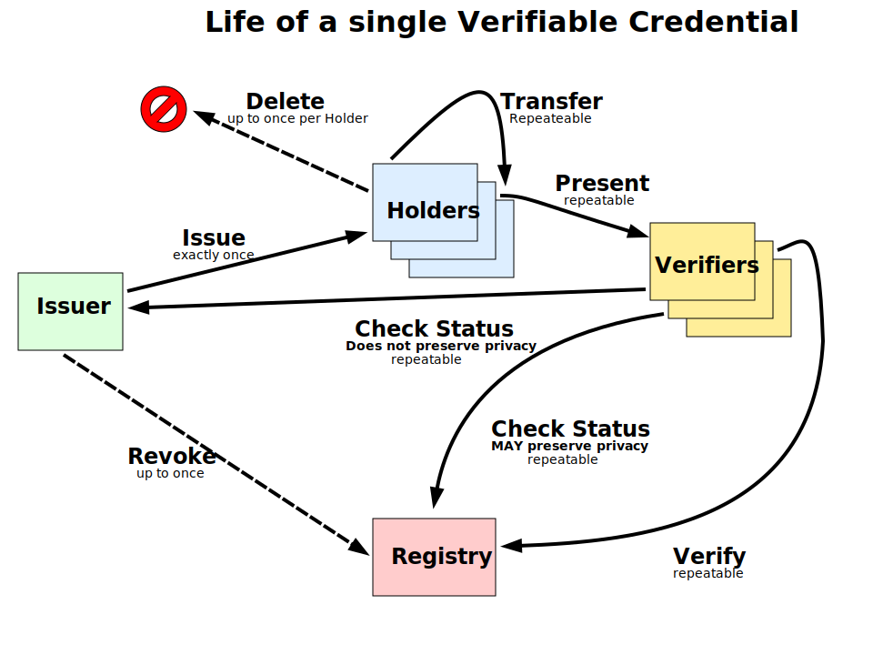

# Concepts

## Verifiable Credentials (VCs)

### What are Verifiable Credentials?

Verifiable Credentials (VCs) are standardized digital statements made by the issuer about a subject. They serve as a cryptographically secure, tamper-evident, and privacy-preserving mechanism for presenting proofs about an individual's or entity's attributes or qualifications. This digital assertion allows an individual or entity to prove various facets of their identity or other claims without having to reveal excessive information.

In the physical world, a driving license, a university degree, or a membership card can serve as credentials. In the digital realm, VCs replicate this concept, offering a digital equivalent that's cryptographically secure and verifiable.

### Standards and Specifications

VCs operate based on a standard laid out by the [World Wide Web Consortium (W3C)](https://www.w3.org/). This standard ensures that VCs are consistent, interoperable, and recognized across various digital platforms and applications.

- [W3C Verifiable Credentials Data Model](https://www.w3.org/TR/vc-data-model/): This specification provides a detailed guide on how VCs are structured, issued, and verified. It establishes a foundation for building trust on the web, ensuring that digital attestations are as reliable as their physical counterparts.

### Components of a Verifiable Credential

1. **Issuer:** The authoritative entity that creates and signs the VC. The credibility of a VC often depends on the reputation of its issuer.
2. **Subject:** The individual or entity that the VC pertains to. It could be a person, organization, device, or any other entity that the claim is about.
3. **Claim:** The assertion or statement made about the subject. For example, a university (issuer) can assert that a student (subject) has achieved a particular degree (claim).
4. **Proof:** Cryptographic evidence that verifies the authenticity of the VC, ensuring that it hasn't been tampered with since its creation. This proof is typically a digital signature provided by the issuer.

### Advantages of Verifiable Credentials

- **Decentralization and Privacy:** VCs can be used without being tethered to a centralized authority after issuance. This decentralization means users can control and share their credentials without an intermediary, enhancing privacy.
- **Selective Disclosure:** Holders of VCs can choose which parts of their credentials they wish to share, offering finer control over personal data.
- **Interoperability:** Owing to the W3C standard, VCs can be seamlessly used across various platforms and services.
- **Security:** Cryptographic proofs ensure that VCs are tamper-evident and verifiable, instilling trust in their authenticity.

### Use Cases

VCs can be employed in a plethora of scenarios:

- **Identity Verification:** Proving one's identity on online platforms without oversharing personal details.
- **Academic Credentials:** Sharing academic achievements and qualifications digitally.
- **Healthcare:** Sharing medical records or vaccination status in a secure and verifiable manner.
- **Financial Services:** Proving creditworthiness or transaction history.

### In Summary

Verifiable Credentials are a monumental step towards a more trustable and private digital ecosystem. By allowing individuals and entities to share and prove information about themselves without jeopardizing their privacy or data security, VCs are poised to redefine how we trust and verify data online.

# Claims Module

The Claims module in the ixo system facilitates the management and verification of claims, aligning with the W3C standards for Verifiable Credentials (VCs).

## Overview

VCs are digital attestations made by an issuer regarding a subject. These claims are both cryptographically secure and tamper-evident, ensuring their integrity. In the ixo system, the data model for a VC is defined by a **Claim Schema**. Each claim schema is established as part of a Protocol ([Entity](/x/entity/spec/02_state.md#entity) with type `protocol`) that includes a method for evaluating the claim and the criteria for its approval.

Protocols in the ixo system are identifiable by an Entity Identifier in the DID format: `did:ixo:entity:{string}`. Each claim and its evaluation is distinguished by its unique `id`, which for example is the `cid` hash value, which also serves as its cryptographic proof.

An ixo entity can have one or more claim protocols represented as a `linkedClaim`. Agents can be authorized by the entity to submit or evaluate claims, utilizing the entity's capability delegation verification method and issuing `authz` grants to these agents.

## Key Features

1. **Authorize Agents for Claim Submission:**
   - Agents are individuals or entities with valid DIDs.
   - The "service" agent, acting for an entity, can be a Group. This group can be:
     - Any member from a predefined group member list.
     - The Group by governance (referring to the group account).
2. **Authorize Agents for Claim Evaluation:**

   - The “evaluation” agent acting on behalf of an entity can be a Group:
     - Either any Member of a Group.
     - Or the Group by governance.
   - There's flexibility in evaluation:
     - Multiple agents can be tasked to evaluate claims.
     - A single claim can be assessed by multiple agents for additional insights (like getting a second opinion).
     - Agents can be authorized for either a collection of claims or specifically identified ones.
     - Agents can have constraints, like evaluating claims only within certain dates or evaluating a capped number of claims.

3. **Registry Maintenance of Claims with Verification Proofs:**

   - Claims are organized under a [Collection](02_state.md#collection), where each collection contains claims submitted under a specific protocol for a distinct entity. Collections are identified by an `id` which is the [CollectionSequence](05_params.md).
   - Every claim has a unique `id`, which is typically the CID, doubling as its cryptographic proof.
   - Claims have a default `status` of `1`, indicating they've been `submitted`. Enum is [EvaluationStatus](02_state.md#evaluationstatus)
   - After evaluation, a claim's status can change to:
     - `approved` (=2)
     - `rejected` (=3)
     - `disputed` (=4)

4. **Payment Authorization:**

   - Payments can be authorized to agents or evaluators' `account` upon various claim activities like submission, evaluation, approval, or when disputes arise.

5. **Recording Counter-Claims Evidence:**
   - In case of disputes, evidence for counter-claims can be recorded, facilitating transparency and conflict resolution.

## Conclusion

The Claims module is instrumental in the ixo system, providing a robust infrastructure for the creation, management, evaluation, and verification of claims. With the integration of the W3C standard for VCs, it ensures that all claims are both trustworthy and verifiable.
